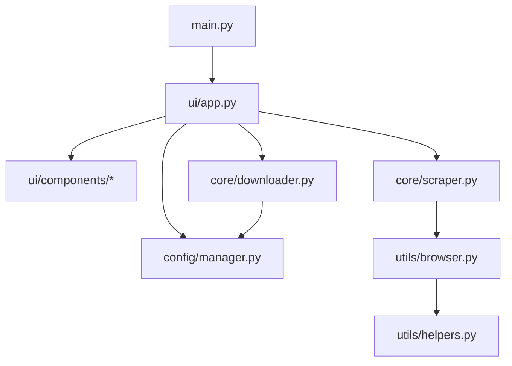

# Guía de Mantenimiento - AnimeDL

Esta guía describe la nueva arquitectura modular de AnimeDL, las dependencias entre componentes y cómo realizar el mantenimiento del sistema.

## 1. Estructura de Directorios

La aplicación se ha organizado siguiendo una arquitectura de capas:

```text
src/
├── config/             # Gestión de configuración y constantes
│   └── manager.py      # Carga/guardado de config.json y User-Agents
├── core/               # Lógica de negocio (Core Business Logic)
│   ├── downloader.py   # Gestión de descargas fragmentadas y reintentos
│   └── scraper.py      # Extracción de metadatos y enlaces de JkAnime
├── ui/                 # Interfaz de Usuario (Flet)
│   ├── components/     # Componentes UI reutilizables
│   │   ├── activity_log.py
│   │   ├── download_tab.py
│   │   └── library_tab.py
│   ├── app.py          # Controlador principal de la UI e integración
│   └── styles.py       # Constantes de diseño (colores, temas)
├── utils/              # Utilidades generales
│   ├── browser.py      # Gestión de Playwright y navegadores
│   └── helpers.py      # Funciones auxiliares (rutas, lazy loading)
└── main.py             # Punto de entrada de la aplicación
tests/                  # Pruebas unitarias
└── ...
```

## 2. Diagrama de Dependencias (Conceptual)



## 3. Principios de Diseño Aplicados

- **SOLID (Single Responsibility)**: Cada clase tiene una única responsabilidad. `Downloader` solo descarga, `Scraper` solo extrae datos, `AnimeDownloaderApp` coordina la UI.
- **Lazy Loading**: Los módulos pesados como `playwright` y `aiohttp` se cargan solo cuando son necesarios para mejorar el tiempo de arranque.
- **Inyección de Dependencias**: Los servicios (Scraper, Downloader) reciben la configuración y otros recursos necesarios en su constructor.
- **Asincronía**: Toda la red y operaciones de I/O son asíncronas (`async/await`) para evitar bloquear la interfaz.

## 4. Guía de Mantenimiento

### Actualización de Scrapers
Si JkAnime cambia su estructura HTML, los cambios deben realizarse principalmente en `src/core/scraper.py`.

### Modificación de la UI
Para añadir nuevas pestañas o modificar las existentes, edite los archivos en `src/ui/components/` y regístrelos en `src/ui/app.py`.

### Ejecución de Tests
Para validar que los cambios no rompan la funcionalidad existente, ejecute:
```bash
python -m unittest discover tests
```

### Gestión de Configuración
La configuración se almacena en `config.json`. Si se añaden nuevas opciones, asegúrese de actualizar los valores por defecto en `src/config/manager.py`.
